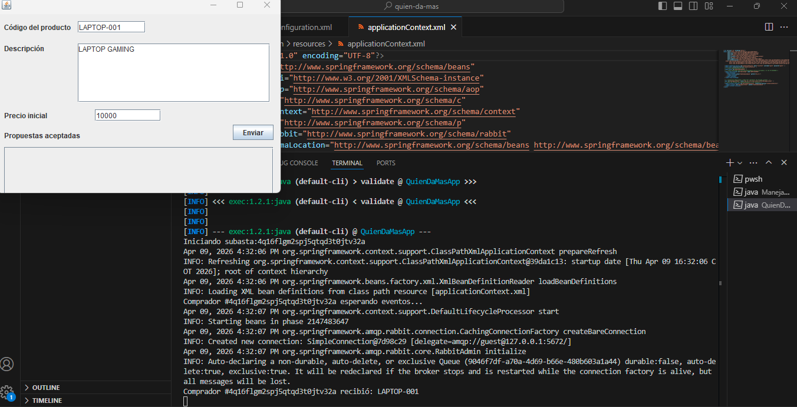
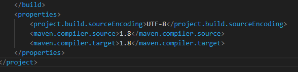
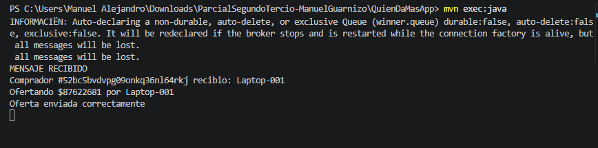
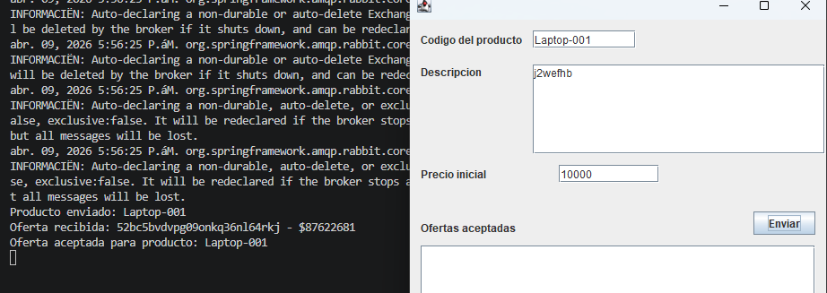
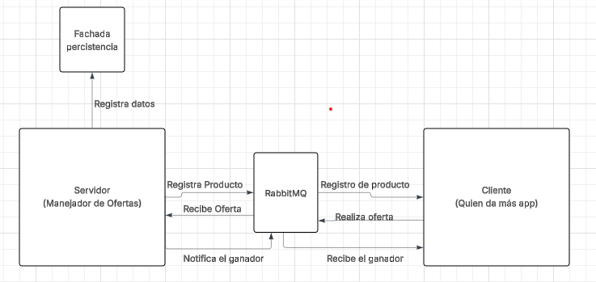

#PARCIAL Manuel Alejandro Guarnizo

## Primero empezamos probando los servicio levantando el rabbitmq y lanzando una petición para ver si esta en el Cliente

###  Cambiamos la versión de java en ambos pom

### Creamos las clases necesarias para responder a las ofertas y tambien recibir el ganador

## el funcionamiento

## diagrama de arquitectura (AUNQUE NO NOTIFICA A EL CLIENTE)

# 1. RabbitMQ
docker stop rabbitmq-par2ARSW
docker stop rabbitmq-par2ARSW  
docker run -d --name rabbitmq-par2ARSW -p 5672:5672 -p 15672:15672 rabbitmq:3-management

# 2. Servidor
cd ManejadorOfertas
mvn clean compile
mvn exec:java

# 3. Clientes (3 o mas terminales)
cd QuienDaMasApp
mvn clean compile
mvn exec:java